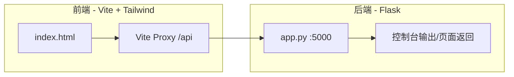

# News Form Python

这是一个基于 Python Flask 后端和 Vite + Tailwind CSS 前端的新闻投稿系统示例项目。它展示了如何实现一个完整的前后端分离表单提交流程。

## 🚀 主要功能

- **新闻投稿表单**：提供标题、作者、分类及内容输入。
- **响应式设计**：使用 Tailwind CSS 构建，适配多种屏幕尺寸。
- **前后端通信**：通过 Vite 代理（Proxy）实现跨域请求转发。
- **Python 后端处理**：Flask 服务器接收并打印投稿内容，返回自定义成功页面。

## 🏗️ 项目架构



### 技术栈
- **前端**: Vite, Tailwind CSS, Vanilla JS/HTML
- **后端**: Python 3, Flask
- **工具**: Node.js, npm/yarn

## 📂 项目结构

```text
news-form-python/
├── backend/            # Python 后端目录
│   ├── app.py          # Flask 应用主文件
│   └── requirements.txt # 后端依赖
├── frontend/           # 前端目录
│   ├── index.html      # 表单主页面
│   ├── src/            # 前端源码
│   ├── tailwind.config.js # Tailwind 配置
│   └── vite.config.js  # Vite 配置 (包含代理设置)
└── .gitignore          # Git 忽略文件
```

## 🛠️ 启动步骤

### 1. 启动后端 (Flask)

在 `backend` 目录下：

```bash
cd backend
# 建议使用虚拟环境
python3 -m venv venv
source venv/bin/activate  # macOS/Linux
# venv\Scripts\activate   # Windows

pip install -r requirements.txt
python app.py
```
后端默认运行在 `http://127.0.0.1:5000`。

### 2. 启动前端 (Vite)

在 `frontend` 目录下：

```bash
cd frontend
npm install
npm run dev
```
前端默认运行在 `http://localhost:5173`。

## 💡 使用说明

1. 确保后端和前端服务器均已启动。
2. 访问前端地址 `http://localhost:5173`。
3. 填表并提交，数据将通过 `/api/submit` 发送，由前端代理转发至后端的 `/submit` 接口。
4. 提交成功后，后端会返回一个带有“返回首页”链接的成功提示页面。
